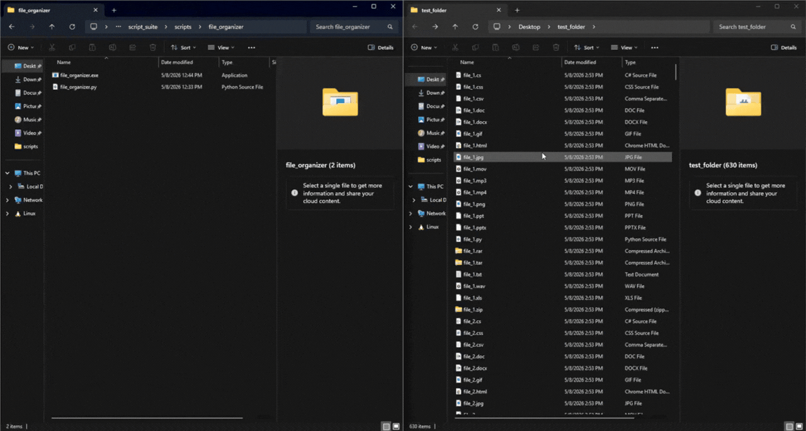
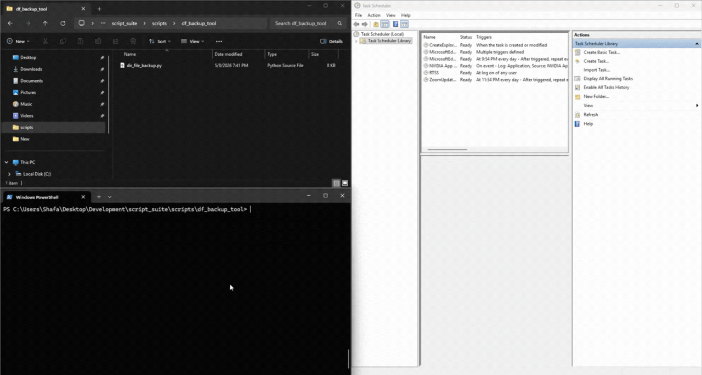

<p align="center">
  
</p>

# IT-ToolKit

Welcome to IT-ToolKit!
<br>

This is my personal suite of lightweight Python scripts, built to automate and optimize repetive tasks in IT environments.

### What This Repository Contains
- Focused, easy-to-use tools that eliminate manual busywork
- Lightweight alternatives to bulky third-party software
- Portable `.exe` builds for Windows (no Python installation required)
- Designed for real-world use — from a flash drive, Task Scheduler, or direct execution

> This suite will continue to be updated as I identify more repetitive workflows and system administrative tasks, which would benefit through automation.

## Current Tools

### 1. File Organizer (`file_organizer.py`)
Automatically scans a folder and organizes files into type-based subfolders (Documents, Images, Archives, etc.).

**Key Features**
- Simple GUI workflow
- Scan first to preview file types
- Option to skip specific file types
- Activity log and clear before/after folder structure

### 2. Directory & File Backup (`dir_file_backup.py`)
Creates timestamped backups of files or entire folders with a one-time setup.

**Key Features**
- One-time configuration (saves source, destination, and settings)
- Generates `task_scheduler_params.txt` file, with list of arguments `line-by-line` for Windows Task Scheduler integration
- Recurring automated backups with zero extra clicks after setup
- Designed for daily/weekly scheduled runs

## Tool Demos

### File Organizer Demo


**Workflow**
1. Launch the tool
2. Browse to the target folder
3. Click **Scan** to detect file types
4. Uncheck any types you want to skip
5. Click **Run Script**
6. Review the log and organized folder structure

### Directory & File Backup Demo


**Workflow**
1. First run: Launch with `--setup` (or click Setup in GUI)
2. Select source file/folder and destination
3. Click **Save Config**
4. Open `task_scheduler_params` file to get the necessary parameters for Task Scheduler
5. Proceed to Task Scheduler and click on 'Create Basic Task' in the right pane (simplicity purposes)
6. Name task, and optionally provide description
7. Specify date to start, time, and how many times to repeat
8. Click **Next**, and select when to schedule/repeat task
9. Click **Next** and select 'Start a Program'

## Prerequisites

- **Python 3.11+** (only if running the `.py` files directly)
- Recommended: Install from [python.org](https://www.python.org/downloads/) and check “Add Python to PATH”

> **Note for Windows users**: If Python is not installed, running a `.py` file may prompt you to install it via the Microsoft Store. The python.org installer is preferred for better consistency.

## Executable Builds (.exe)

Portable Windows executables are available for File Organizer — no Python required.

- `file_organizer.exe`

**Built with Nuitka** for better performance and significantly fewer false positives compared to PyInstaller.

> **Windows Defender Note**: The `.exe` files may trigger a SmartScreen or Defender warning on first run (common with compiled Python apps). You can safely allow them or add the folder to exclusions.

## Quick Start

The simplest approach for File Organizer is to use the executable build.

### 1. Recommended: Run the `.exe` files (Windows)

If you already have the compiled executables, run them directly:

**PowerShell**
```powershell
# File Organizer
cd "scripts\file_organizer"
.\file_organizer.exe
```

You can also double-click the `.exe` in File Explorer.

### 2. Run the Python files (`.py`)

Use this method if you are running from source and have Python 3.11+ installed. <br>
Please ensure your current (relative) directory contains the **scripts** directory

**File Organizer**
```powershell
cd "scripts\file_organizer"
python file_organizer.py
```

**Directory & File Backup (first run / reset file source and destination)**
```powershell
cd "scripts\df_backup_tool"
python dir_file_backup.py
# if you want to reset chosen source and destination selections, run following
python dir_file_backup.py --setup
```

If `python` is not recognized, try `py` instead:

```powershell
py file_organizer.py
py dir_file_backup.py --setup
```

## Repository Structure

Quick view of the current source layout:

```text
.
├── assets/
│   └── dir_file_backup_demo.gif
|   └── file_organizer_demo.gif
|   └── suite_logo.png
├── df_backup_tool/
│   └── dir_file_backup.py
|── file_organizer/
|   └── file_organizer.exe
|   └── file_organizer.py
├── README.md
```